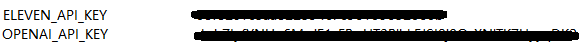

# ChatGPT with ElevenLabs

## Project Introduction

In this project, a picture will be captured using the laptop's camera, and this picture will be sent to ChatGPT for analysis. Then, the response text will be sent to ElevenLabs to be read aloud with a realistic voice.

### Demo

1. __take a picture from camera__

    

2. __reponse text from chatGPT__

    *The image features a package of "Seeberger" brand roasted almonds. On the colorful packaging, the words "geröstete MANDELN ohne Salz" are prominently displayed in large, bold letters, which in English means "roasted ALMONDS, not salted." Above the brand name, a small green "Vegan" label is visible, signifying that the product is suitable for vegans. Almonds are scattered across the package design to give an idea of what the product looks like. The background color of the package transitions from a warm yellow at the top to a soft sky-blue around the center.*

    *这张图片展示了一个“Seeberger”品牌的烤杏仁包装。包装色彩鲜明，在显眼的位置用大号粗体字写着 “geröstete MANDELN ohne Salz”，中文意思为“烤杏仁，不含盐”。品牌名称上方有一个小绿色的“Vegan”标签，表明该产品适合素食者食用。包装设计上散落着杏仁，以展示产品的外观。包装的背景色从顶部的温暖黄色过渡到中心附近的柔和天蓝色。*

3. Audio produced by ElevenLabs will be read aloud automatically.

for this purpose we need to create environment variables in windows for the api keys.

📂 Project Organization
------------
    ├── 📂 artifacts          <- Produced pictures and audio files
    ├── 📂 miscellaneous      <- Material for README.md
    ├── 📂 references         <- Documents and resources referenced in the project
    ├── 📂 src                <- Main codebase of the project
    │   ├── 📂 camera         <- Code related to camera operations
    │   ├── 📂 chatGPT        <- ChatGPT integration code
    │   ├── 📂 elevenLabs     <- ElevenLabs API integration code
    ├── 📂 venv               <- Virtual environment
    ├── 📃 .flake8            <- Configuration file for the Flake8 linter
    ├── 📃 .gitignore         <- Specifies intentionally untracked files to ignore
                                  in Git
    ├── 📃 main.py            <- Main script for project execution
    ├── 📃 README.md          <- The top-level README for info about this project
    ├── 📃 requirments.txt    <- List of dependencies required for this project

✅ Preconditions for this project:
------------

### Add key in environment variables



Add path in enviroment variables


### Install Tesseract-OCR

  If you haven't already installed Tesseract-OCR, you need to download and install it from the official [Tesseract GitHub repository](https://github.com/UB-Mannheim/tesseract/wiki)

  #### Add Tesseract to PATH

  1. Find the installation directory of Tesseract-OCR. It's usually something like `C:\Program Files\Tesseract-OCR` where the `tesseract.exe` is located.
  2. Open the Start Search, type in "env", and choose "Edit the system environment variables".
  3. In the Edit Environment Variables window, click New and paste the path to the Tesseract-OCR directory.
  4. After you have installed Tesseract and added it to your PATH, restart your PowerShell session to ensure that the new PATH is loaded. Also, restart any IDE or editor where you are running the Python script to recognize the changes to the environment variables.

  #### Verify Installation

  - To verify that Tesseract is correctly installed and accessible from your PATH, run the following command in your PowerShell:

    ```powershell
    tesseract --version
    ```

### Install FFmpeg for Eleven Labs' Play Audio Function

```python
from elevenlabs import generate, play

audio = generate(text, voice="DPsqCHWEBVTyO9962K8u")
play(audio)
```

#### Download ffmpeg (Window version)

  1. Download the appropriate version for Windows ([Go to the FFmpeg Download Page](https://github.com/BtbN/FFmpeg-Builds/releases)).

  2. Extract the files to a directory (e.g., C:\ffmpeg). And add ffmpeg to the System Path.

  3. Verify Installation:

      ```powershell
      tesseract --version
      ```

## Import file from source code directory

For this project, we are adding an __init__.py file to package the source code in one package, making it easier to import at any other Python file.

### Step 1: Modify the Project Structure

Add an __init__.py file to the src directory so that Python treats it as a package.

### Step 2: Modify the Import Statements

```python
from chatGPT import gpt_utils

gpt_utils.test_connection()
```
